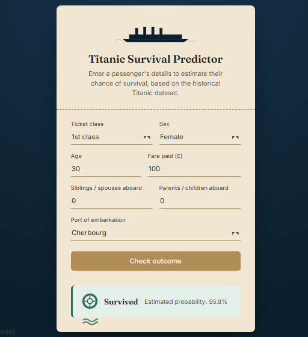

# Titanic Survival Prediction

End-to-end ML portfolio project: EDA, model training, FastAPI backend, and a static frontend, deployed live across two services.

**Live demo:** [Frontend](https://huggingface.co/spaces/AbdukganiyMK/titanic-survival-prediction-frontend)
**API docs:** [https://titanic-survival-prediction-o1fp.onrender.com/docs](https://titanic-survival-prediction-o1fp.onrender.com/docs)



## Problem

Predict whether a Titanic passenger survived, using passenger data (class, sex, age, fare, family aboard, port of embarkation). Binary classification, trained on the classic 891-row Kaggle Titanic dataset.

## Approach

1. **EDA** — explored survival rates by class, sex, age, and fare. Confirmed the well-known pattern: women and first-class passengers survived at much higher rates.
2. **Feature engineering** — used `Pclass`, `Sex`, `Age`, `SibSp`, `Parch`, `Fare`, `Embarked`. Categorical `Embarked` was one-hot encoded into explicit `Embarked_Q` / `Embarked_S` boolean columns rather than `pd.get_dummies(drop_first=True)`, because that function decides which category to drop based on what's present in a given call, which breaks single-row inference.
3. **Model** — compared Logistic Regression, Random Forest, and SVM. Random Forest led on cross-validation, but Logistic Regression won on the held-out test set by F1, used as the tiebreaker over raw accuracy due to a 38/62 class imbalance. Final model: `StandardScaler` + `LogisticRegression`, bundled as a single scikit-learn `Pipeline` and saved with `joblib`.
4. **API** — FastAPI backend with a typed `/predict` endpoint (Pydantic request/response models), auto-generated docs at `/docs`.
5. **Frontend** — static HTML/CSS/JS form, ocean/ticket visual theme, calls the API directly.

## Results

| Model               | Accuracy | F1   |
|----------------------|----------|------|
| Logistic Regression  | 0.750 | 0.821 | 
| Random Forest        | 0.727 | 0.799 |
| SVM                  | 0.719 | 0.810 |

Logistic Regression selected for deployment based on the F1 comparison above.

## Architecture

Backend and frontend are deployed as two separate services, not bundled together:

- **Backend** — FastAPI on Render, deployed via Docker using the repo's `Dockerfile`.
- **Frontend** — static HTML/CSS/JS on a Hugging Face Static Space.

This split wasn't the original plan. Hugging Face Spaces puts free-tier Gradio accounts on ZeroGPU hardware, which can't be downgraded without a PRO subscription, and the Docker SDK on Spaces requires a paid plan. Splitting onto Render (backend) and a HF Static Space (frontend, no compute needed) avoided both paywalls. CORS on the backend is set to `allow_origins=["*"]` to allow the cross-origin frontend calls.

## Known trade-off

The model was pickled under scikit-learn 1.9.0 locally. Render resolves 1.9.1 at build time, which triggers an `InconsistentVersionWarning` at API startup. This is accepted as low risk here: the pipeline is only a `StandardScaler` + `LogisticRegression`, both simple, stable transforms unlikely to have breaking changes across a patch version. Predictions were verified live and match local output.

## Running locally

Requires [uv](https://docs.astral.sh/uv/).

```bash
git clone https://github.com/moshood-abdulganiyu/titanic-survival-prediction.git
cd titanic-survival-prediction
uv sync
uv run uvicorn server.main:app --reload
```

API will be live at `http://localhost:8000`, docs at `http://localhost:8000/docs`.

For the frontend, open `client/index.html` directly, or serve it with any static file server. Update `API_URL` in `client/app.js` to point at your local backend if testing locally.

## Tech stack

- **ML:** scikit-learn, pandas, joblib
- **Backend:** FastAPI, uvicorn
- **Frontend:** HTML, CSS, JavaScript (no framework)
- **Dependency management:** uv
- **Deployment:** Render (backend), Hugging Face Static Spaces (frontend)